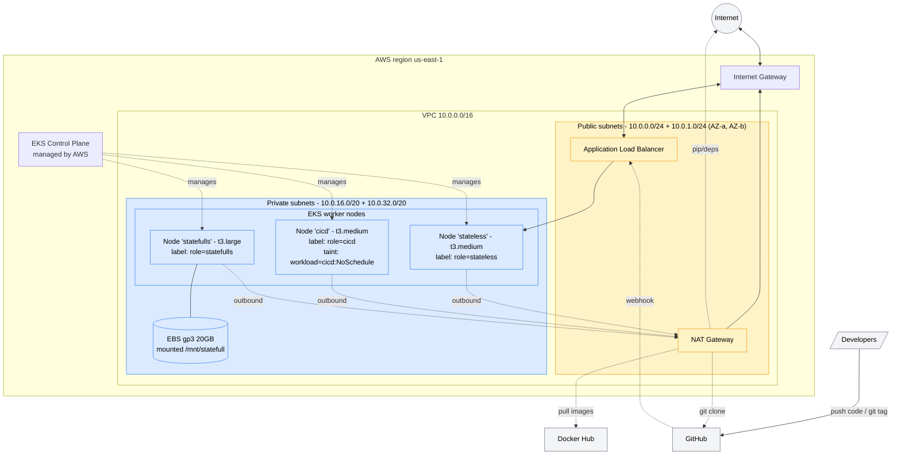
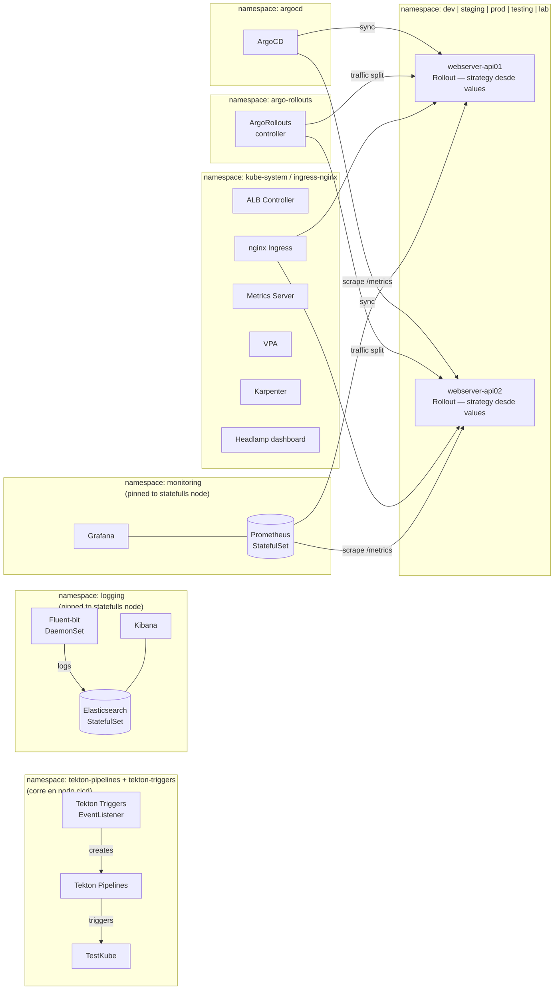
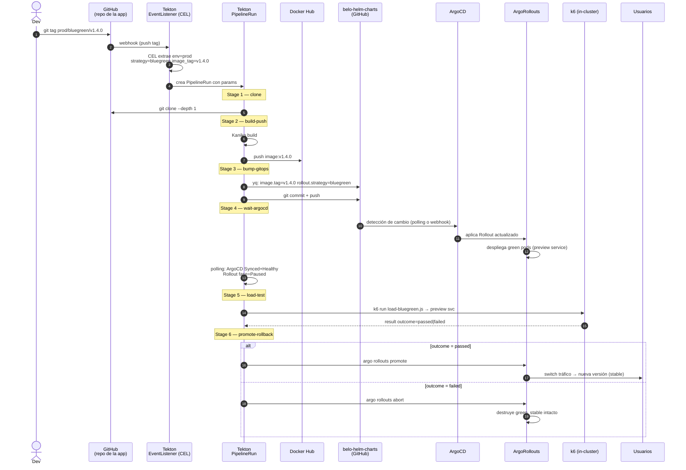

# Arquitectura

Este doc tiene tres diagramas: la **infra de AWS**, los **componentes
internos del cluster**, y el **flujo CI/CD**. GitHub renderiza Mermaid
nativamente, así que los diagramas se ven al abrir este archivo en la web.

---

## 1. Infraestructura AWS



### Plan de CIDRs y disponibilidad de IPs

| Subnet | CIDR | IPs totales | IPs usables (AWS reserva 5) | Uso |
|---|---|---|---|---|
| public-a | 10.0.0.0/24 | 256 | **251** | ALB + NAT |
| public-b | 10.0.1.0/24 | 256 | **251** | ALB (HA) |
| private-a | 10.0.16.0/20 | 4096 | **4091** | Nodos EKS + pods |
| private-b | 10.0.32.0/20 | 4096 | **4091** | Nodos EKS + pods |
| **Total VPC** | 10.0.0.0/16 | 65 536 | **8 684 (las definidas)** | |

> Las privadas con /20 le dejan margen amplio a Karpenter para escalar.
> Cada pod toma una IP del VPC con AWS VPC CNI; con 4091 IPs útiles por
> AZ, el techo práctico está en cantidad de pods por nodo (depende del
> instance type — t3.medium soporta hasta 17 pods por defecto, t3.large
> hasta 35).

### Accesos de red (matriz simplificada)

| Origen | Destino | Por qué | Mecanismo |
|---|---|---|---|
| Internet | ALB:443 | Tráfico de usuarios a las apps | SG del ALB con 0.0.0.0/0 en 443 |
| ALB | nodos:80 (NodePort) | Llega tráfico a las apps | SG entre ALB y nodos |
| nodos EKS | NAT GW | Salida a internet | Route table de la subnet privada |
| nodos EKS | github.com:443 | Clone y webhooks | Vía NAT |
| nodos EKS | registry-1.docker.io:443 | Docker pulls | Vía NAT |
| nodos EKS | pypi.org, files.pythonhosted.org | Build de Kaniko | Vía NAT |
| nodos EKS | api.eks.us-east-1.amazonaws.com | kubelet → control plane | Endpoint privado del cluster |
| nodos EKS | kubernetes.svc | Comunicación entre pods | DNS y CNI internos |

---

## 2. Componentes internos del cluster



### Pinneo de pods statefull al nodo correcto

Tres recursos terminan en el nodo `statefulls`:

- **Elasticsearch** (`logging` namespace) — necesita el disco para shards.
- **Prometheus** (`monitoring` namespace) — TSDB persistente.
- (Opcional) **ArgoCD repo-server cache** si el cluster crece.

Los manifestos lo logran con un `nodeSelector + toleration`:

```yaml
nodeSelector:
  role: statefulls
tolerations:
- key: workload
  operator: Equal
  value: statefulls
  effect: NoSchedule
```

Y los nodos stateless tienen un **anti-affinity** para que las apps **no**
caigan ahí, dejándole CPU al statefull.

### HPA y VPA

- **HPA** (Horizontal Pod Autoscaler) — escala las **apps** (api01, api02)
  según CPU > 70% o requests/sec personalizado vía Prometheus Adapter.
- **VPA** (Vertical Pod Autoscaler) — corre en modo `recommendation` para
  todas las pods. **No en `auto`** porque colisiona con los rollouts de
  ArgoCD (modificaría el spec entre syncs).
- **Karpenter** — ve los pods Pending del HPA y levanta nodos nuevos.
  Configurado para preferir Spot en pods con label `workload-class=stateless`.

---

## 3. Flujo CI/CD



> El diagrama muestra el caso BlueGreen. Para Canary, el Stage 6 hace tres
> promote intermedios (25% → k6 → 50% → k6 → 100%), abortando en cualquier
> fallo. Para RollingUpdate, el deploy está completo al llegar al Stage 5 y
> el Stage 6 solo hace undo si k6 falla.

### Stages del Pipeline (implementados en `belo-helm-charts/charts-core/pythonapps/templates/pipeline-templates/`)

| # | Task Tekton | Qué hace |
|---|---|---|
| 1 | `git-clone-app` | `git clone --depth 1` del repo de la app al workspace `source` |
| 2 | `kaniko-build-push` | Build desde `src/Dockerfile` + push a Docker Hub (cache 24h) |
| 3 | `bump-gitops-image` | `yq`: actualiza `image.tag` y `rollout.strategy` en el values del ambiente; commit + push a `belo-helm-charts` |
| 4 | `wait-argocd-sync` | Polling hasta ArgoCD `Synced+Healthy` y Rollout en fase `Paused` (BG/Canary) o `Healthy` (Rolling) |
| 5 | `run-load-test` | k6 contra el endpoint correcto según strategy; emite Tekton result `outcome=passed\|failed` sin fallar el pipeline |
| 6 | `promote-rollback` | Actúa sobre `outcome`: BlueGreen promote/abort; Canary promote faseado con k6 intermedio o abort; Rolling no-op/undo |

### Convención de tag

```
refs/tags/<env>/<strategy>/<semver>
```

El interceptor CEL del EventListener filtra solo tags con exactamente esa forma
(5 segmentos en el ref). Tags con formato distinto no disparan ningún pipeline.

| Tag | environment | strategy | image_tag |
|---|---|---|---|
| `prod/bluegreen/v1.4.0` | prod | bluegreen | v1.4.0 |
| `staging/canary/v1.4.0` | staging | canary | v1.4.0 |
| `dev/rollingupdate/v1.4.0-rc1` | dev | rollingupdate | v1.4.0-rc1 |

### Strategy por deploy, no por app

Las apps no tienen una strategy fija. `bump-gitops` escribe `rollout.strategy`
en el values del ambiente en cada run, reemplazando el valor anterior. Los
Services e Ingresses `stable` y `preview` existen siempre (topología invariante),
por lo que cambiar de BlueGreen a Canary entre deploys consecutivos no genera
ninguna disrupción de red.

### Por qué nginx Ingress además del ALB Controller

ArgoRollouts soporta varios `trafficRouting`. El de **ALB** funciona pero
requiere TargetGroupBinding con dos TG (canary + stable) y mover pesos vía
API de AWS — es lento y a veces flaky. El de **nginx** usa annotations
estándar (`nginx.ingress.kubernetes.io/canary-weight: "5"`) y reacciona
en milisegundos.

Esquema final: **ALB termina TLS y entra al cluster**, nginx Ingress hace
el routing por Service y maneja el split de tráfico para Canary. Para
BlueGreen alcanza con ALB nomás (es un switch atómico de target group).

---

## 4. Mapa de qué corre dónde

| Componente | Dónde corre | Tipo | Notas |
|---|---|---|---|
| EKS Control Plane | AWS managed | managed | |
| Karpenter | stateless | kube-system Deployment | escala los nodos stateless |
| ALB Controller | stateless | kube-system Deployment | IRSA con rol Terraform |
| nginx Ingress | stateless | ingress-nginx Deployment | routing canary fino |
| ArgoCD | stateless | argocd Deployment | apunta a belo-helm-charts |
| ArgoRollouts | stateless | argo-rollouts Deployment | controla BlueGreen y Canary |
| rbac-manager | stateless | rbac-manager Deployment | operator de RBACDefinition |
| Grafana, Kibana, Headlamp | stateless | varios Deployment | |
| Apps (api01, api02) | stateless | apps Rollout | NO Deployment, ArgoRollout — strategy según values del ambiente |
| Tekton controller | cicd | tekton-pipelines Deployment | toleration workload=cicd |
| Tekton EventListener | cicd | tekton-pipelines Deployment | webhook desde GitHub |
| TestKube | cicd | testkube Deployment | lanza los tests k6 |
| PipelineRuns (pods) | cicd | tekton-pipelines Pod efímero | PVC gp3 de 1 GiB, se borra al terminar |
| Elasticsearch | statefulls | logging StatefulSet | pinneado, datos en /mnt/statefull |
| Prometheus | statefulls | monitoring StatefulSet | pinneado, datos en /mnt/statefull |


---

## 6. Deuda técnica conocida (lo que dejamos para "después")

Vale más documentarla que esconderla:

- **Sin WAF** — el ALB no tiene AWS WAF asociado. Para una demo está bien;
  para prod habría que agregarlo (~$5/mes + reglas).
- **Sin VPC Endpoints** — todo el tráfico a S3, ECR (futuro), STS, etc.
  pasa por NAT. Agregar gateway endpoints a S3 y DynamoDB es **gratis** y
  saca tráfico del NAT. Si llega a producción, hacerlo.
- **Single-AZ NAT** — un NAT en una AZ. Si esa AZ cae, las pods de la
  otra AZ pierden internet. Para HA real, dos NATs (~$33/mes extra).
- **Sin secrets management externo** — los secrets de Tekton (token Docker
  Hub, deploy keys) están en Secrets de K8s. Migrar a AWS Secrets Manager
  + External Secrets Operator es la siguiente mejora.
- **Sin imagen base hardened** — el Dockerfile de las apps usa
  `python:3.12-slim` directo. Para prod, una imagen distroless o
  Chainguard reduce CVEs y tamaño.
- **Sin multi-region** — un cluster en us-east-1. La replicación
  cross-region quedaría para una segunda fase.
